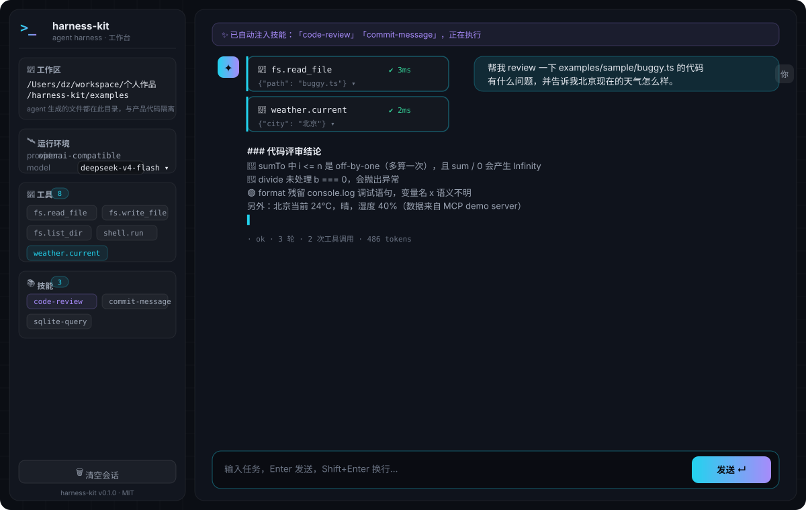

# 璇玑（xuanji）

> **一个轻量、可扩展、Provider 无关的 Agent Harness** —— 把 **Agent Loop（代理循环）**、**MCP（模型上下文协议）**、**Skill（技能系统）** 组合成一个带**完整工作台**的 agent 运行时，像 Codex 一样在浏览器里对话、选工作区、看它一步步调工具干活。

[](https://www.typescriptlang.org/)
[](https://nodejs.org/)
[](https://github.com/dz2001-beep/agent-xuanji)
[](LICENSE)
[](https://github.com/dz2001-beep/agent-xuanji)

---

## 🖥 界面一览



`npm run ui` 启动即得：**侧边栏**（工作区 / 运行环境 / 工具 / 技能）+ **主区**（流式对话、工具调用卡片、技能注入提示、模型切换）+ 底部输入区。

---

## 这是什么？

harness 是"agent 的操作系统"—— 它不负责模型本身，而是解决让 agent **可靠、可观测、可组合**的工程问题。这个项目用三大支柱把它做成了一个真正能用的产品：

| 支柱 | 解决什么问题 |
|---|---|
| **Agent Loop** | 思考 → 调工具 → 观察 → 再思考的循环如何被工程化：必然终止、可取消、可重试、全程可观测 |
| **MCP** | 如何把任意 MCP server 的工具无缝接入 agent：多 server、命名空间、协议适配 |
| **Skill** | 如何让 agent 按需获得"任务专用指令包"：SKILL.md 约定、相关性匹配、自动注入 |

三者通过 **Harness 组合层**装配：一条 JSON 配置即可把 provider、内置工具、MCP servers、skills 组合成一个可跑的 agent，再包一层 **Web 工作台** 变成人人可用的对话客户端。

---

## ✨ 功能总览

### Agent Loop（`src/loop/`）
- 完整循环编排：模型回复 → 工具调用 → 结果回填 → 继续，直到给出最终答案
- **5 种终止状态**：`ok` / `max-iterations`（预算兜底）/ `stopped`（自定义谓词）/ `aborted`（取消）/ `error`（重试耗尽）
- **健壮性**：LLM 瞬时失败自动退避重试；`AbortSignal` 全链路取消；工具执行超时保护
- **参数预校验**：调用工具前做轻量 JSON-Schema 检查（缺依赖、可解释），拦截模型幻觉
- **类型化事件流**：`llm.delta` / `llm.turn` / `tool.call` / `tool.result` / `tool.error` / `agent.done` —— CLI 实时输出与前端卡片都是它的消费者
- 完整返回：最终回答 + 全程对话记录 + token 统计

### 工具系统（`src/tools/`）
- **内置工具**：`fs.read_file` / `fs.write_file` / `fs.list_dir` / `shell.run`（超时击杀，输出截断）/ **`web.search`**（基于必应中文搜索，无需 API Key，返回标题/链接/摘要）
- **自定义工具**：实现 `Tool` 接口（name / description / schema / execute）即插即用
- 相对路径与 shell 默认 cwd 全部锚定**当前工作区**

### MCP 集成（`src/mcp/`）
- 官方 MCP SDK，支持 `stdio`（本地子进程）与 `streamable-http`（远程）两种传输
- 多 server 注册表，工具命名空间 `<serverId>.<toolName>` 防重名（如 `weather.current`）
- 工具列表缓存 + 按需 `refresh()`；协议结果（`content[]`/`isError`/`structuredContent`）统一归一化
- **自带真实天气 server**（无需 API Key）：
  - `weather.current(city?)` —— **open-meteo 真实天气**（温度/状况/湿度/风速）；城市优先级：**显式传入 > 「我的城市」> IP 自动定位**（ip-api.com）
  - `geo.my_city(city)` —— 设置「我的城市」并持久化（~/.xuanji/weather-city.json）：IP 定位可能不准（网络出口聚合），设置后问"天气怎么样"就用它；工作台侧边栏可直接设置
  - `geo.city` —— IP 定位当前城市/省份/国家/经纬度
  - 网络不可达时自动降级内置演示数据，不打断 agent
  - 测试走 in-memory 真实协议链路

### Skill 技能系统（`src/skills/`）
- **SKILL.md 约定**：目录即技能，frontmatter（name/description）+ 指令正文
- 递归加载，坏文件跳过不阻断；**相关性匹配**零依赖（ASCII 词 + CJK 字符 bigram，中英文查询都可用）
- **自动注入**：运行时按用户请求选 Top-K 技能注入 system prompt，不常驻、省 token
- 内置 3 个示例技能：`code-review`（分级代码评审）/ `commit-message`（Conventional Commits）/ `sqlite-query`

### Provider（`src/llm/`）
- **OpenAI 兼容**：一个实现通吃 DeepSeek / OpenAI / 本地 Ollama / 任意兼容端点，换模型只改配置
- 流式 tool_calls 增量聚合 + token 统计；**wire 名编码**（`.`→`__`）规避 API 对工具名的约束
- **Mock provider**：确定性脚本，无 Key 也能完整体验全流程（CI 友好）
- **运行时模型切换**：工作台下拉直接换模型，不用重启
- `.env` 支持（已被 gitignore，不提交）

### 工作台（`src/server/`，Web 客户端）
- **流式对话**：打字机输出、运行中可停止
- **工作区选择**：面包屑 + 子目录浏览 + 手动输入；切换后 agent 的读写与命令全部锚定该目录，**生成内容与产品代码隔离**
- **工具调用可视化**：可折叠卡片（参数 / 耗时 / 结果预览），失败标红
- **技能注入提示条**、**模型下拉切换**、**启动诊断 + 时间戳日志**（`--log-file` 落盘）
- 深色终端科技风：品牌渐变、玻璃拟态、网格背景、空状态引导

### CLI 与诊断
- `run` / `ui` / `mcp list` / `skills list|show` / `demo` / **`doctor`**（一键自检：Key → 模型连通性 → 工具名合法性 → 工作区）

---

## 🚀 快速开始

```bash
npm install
npm test              # 90 个测试，全部离线
npm run ui            # 构建并启动工作台，浏览器自动打开 http://127.0.0.1:8787
```

**设置 API Key（任选其一）**：

```bash
# 方式一：环境变量（推荐，永久生效写入 ~/.zshrc）
export DEEPSEEK_API_KEY=sk-你的key

# 方式二：项目根目录 .env（已被 gitignore 排除）
echo 'DEEPSEEK_API_KEY=sk-你的key' > .env
```

**验证模型连通性**（有 Key 时）：

```bash
node dist/src/cli/index.js doctor
```

```
[1/4] API Key .......... ✅ 环境变量 DEEPSEEK_API_KEY (sk-a1b2…wxyz)
[2/4] 模型 deepseek-v4-flash .... ✅ 连通（312ms）
[3/4] 工具 wire 名 ....... ✅ 4 个工具名全部符合 API 约束
[4/4] 工作区 ............ ✅ /Users/...
```

**没有 Key 也能玩**：`ui` 自动降级 mock 离线模式（界面顶部有红字提示），全流程可体验。

---

## 🖥 工作台使用指南

启动后你会看到：

```
┌───────────────┬───────────────────────────────────────────────┐
│  📁 工作区     │  ✨ 已自动注入技能：「code-review」…           │
│  🛰 运行环境   │  [你] 帮我 review 一下 buggy.ts 的代码…       │
│  🧰 工具 (8)   │  ✦  📁 fs.read_file        ✔ 3ms             │
│  📚 技能 (3)   │     🔧 weather.current     ✔ 2ms             │
│               │  ### 代码评审结论…（流式输出）                │
│  🗑 清空会话   │  · ok · 3 轮 · 2 次工具调用 · 486 tokens     │
│               │  ┌──────────────────────────────────────────┐ │
│               │  │ 输入任务，Enter 发送…         [发送 ↵]    │ │
│               │  └──────────────────────────────────────────┘ │
└───────────────┴───────────────────────────────────────────────┘
```

**推荐体验路径**：

1. 左侧「📁 工作区 → 切换」选一个项目目录（如 `examples/`）
2. 输入：`帮我 review 一下 sample/buggy.ts 的代码有什么问题`
3. 观察：技能自动注入提示条 → 工具卡片出现（`fs.read_file`）→ 流式回答
4. 点右侧模型下拉，切换 `deepseek-chat` / `deepseek-reasoner` 体验不同模型

> 工作区隔离：agent 所有文件读写、shell 命令都以工作区为基准；系统提示明确要求生成内容归属工作区、不碰产品代码。

---

## 🧩 核心概念速览

```ts
// 1. Agent Loop —— 循环状态机
const agent = new Agent({ provider, tools, onEvent: (e) => console.log(e) });
const result = await agent.run('帮我写一个 sum 函数');
// result.status / result.output / result.messages（完整记录）/ result.usage

// 2. MCP —— 接入任意 MCP server
await registry.connect({ id: 'weather', transport: 'stdio', command: 'node', args: ['weather-server.js'] });
const tools = registry.toTools();   // 已适配 + 命名空间（weather.current）

// 3. Skill —— 目录即技能（SKILL.md）
// ---
// name: code-review
// description: 审阅代码，输出分级评审意见。
// ---
// （正文：完整使用步骤与输出格式约定）
```

```ts
// 4. Harness —— 一条配置装配全部
const harness = await Harness.create({
  config: {
    provider: { type: 'openai', model: 'deepseek-chat' },
    tools: ['fs', 'shell'],
    skills: { dirs: ['./skills'], autoSelect: true },
    mcp: [{ id: 'weather', transport: 'stdio', command: 'node', args: ['./weather-server.js'] }],
  },
});
const result = await harness.run('查一下北京天气，然后 review 一下 src/main.ts');
```

---

## ⌨️ CLI 参考

```bash
xuanji run "prompt..."       # 命令行对话（流式输出；无 prompt 读 stdin）
xuanji run --mock "hi"       # 离线模式
xuanji ui                    # 启动工作台（-p 端口 / --no-open / --log-file）
xuanji doctor                # 一键自检：Key / 模型 / 工具名 / 工作区
xuanji run --trace run.jsonl "问题"   # 运行并记录可重放的 JSONL 轨迹
xuanji replay run.jsonl       # 离线重放轨迹（不调模型）：校验事件顺序 + 统计
xuanji trace diff golden.jsonl actual.jsonl  # 黄金轨迹比对（agent 回归测试）
xuanji mcp list              # 列出配置中 MCP server 的工具
xuanji skills list           # 列出已加载技能
xuanji skills show <name>    # 查看某个技能的完整指令
xuanji demo                  # 端到端演示（无 Key 自动 mock）
```

---

## ⚙️ 配置

`harness.config.json`（或任意路径 + `-c`）：

```json
{
  "provider": { "type": "openai", "model": "deepseek-chat" },
  "models": ["deepseek-v4-flash", "deepseek-chat", "deepseek-reasoner"],
  "tools": ["fs", "shell", "web"],
  "skills": { "dirs": ["./examples/skills"], "autoSelect": true, "maxSelected": 2 },
  "mcp": [
    { "id": "weather", "transport": "stdio", "command": "node", "args": ["dist/examples/mcp-servers/weather-server.js"] }
  ],
  "budget": { "maxIterations": 15, "toolTimeoutMs": 30000, "maxRetries": 2 }
}
```

- API Key 优先级：`config.apiKey` → `OPENAI_API_KEY` → `DEEPSEEK_API_KEY` → `.env`；**空字符串视为未设置**（`export XXX=""` 的坑有醒目标记）
- 只设 DeepSeek Key 时自动指向 `https://api.deepseek.com`

---

## 📁 目录结构

```
src/
├── loop/        Agent Loop 核心（循环状态机 + 类型化事件流）
├── llm/         ChatProvider 接口 + OpenAI 兼容实现 + Mock + wire 名编码
├── tools/       Tool 抽象、JSON-Schema 校验、内置工具（fs/shell）
├── mcp/         MCP 客户端注册表（stdio/http）、工具适配与命名空间
├── skills/      SKILL.md 解析、加载、相关性匹配、渲染注入
├── harness/     组合层：配置归一化 + 装配 provider/tools/mcp/skills
├── server/      Web 工作台：ChatSession + HTTP/SSE API + 前端（public/）
├── diagnose.ts  doctor 自检逻辑
└── cli/         commander CLI（run / ui / doctor / mcp / skills / demo）
examples/        demo MCP server、示例 skills、带 bug 的样例代码、端到端 demo
test/            vitest 单元 + 集成测试（90 个，全离线）
docs/            架构设计文档 + 界面预览图
```

---

## 🧪 测试与工程化

```bash
npm test              # 90 个测试，全部离线
npm run typecheck     # 纯类型检查
npm run build         # tsc 构建 + 静态资源复制
```

覆盖：循环终止/重试/abort/超时/事件顺序、工具注册与参数校验、内置工具行为、SKILL.md 解析与中英文匹配、MCP 真实协议链路（in-memory）、wire 名编解码往返（fake fetch 全链路）、Web 服务端（HTTP API + SSE + 目录浏览 + cwd/模型切换）、.env 加载与优先级、doctor 诊断。

设计取舍的完整讨论（为什么用官方 MCP SDK、为什么零依赖做 schema 校验与技能匹配、如何规避 API 工具名约束、与生产 harness 的差距与扩展点）见 **[docs/ARCHITECTURE.md](docs/ARCHITECTURE.md)**。

---

## ❓ 常见问题

**Q: 为什么报 `no API key found`？**
A: 设置 `export DEEPSEEK_API_KEY=sk-你的key`（注意 `sk-` 开头、非空），或写进 `.env`；`ui` 命令在无 Key 时自动降级 mock 并明确提示。

**Q: 模型报错 `400/404 ... model`？**
A: 模型名在你的 API 环境无效。用 `doctor` 自检，或 `-m deepseek-chat` 换模型；工作台里可直接下拉切换。

**Q: 之前报 `400 Invalid 'tools[0].function.name'`？**
A: 已修复 —— API 禁止工具名带点号，harness 在 wire 层自动编码（`fs.read_file` ↔ `fs__read_file`）。

**Q: 生成的文件和产品代码混在一起怎么办？**
A: 工作台里先「工作区 → 切换」选目标目录；agent 的所有读写与命令都以工作区为基准。

**Q: 端口被占用？**
A: `npm run ui -- --port 9000`。

**Q: 有 API Key 但跑的是 mock？**
A: 空字符串 Key（`export XXX=""`）会被视为未设置；确认 `echo $DEEPSEEK_API_KEY` 输出 `sk-` 开头。

---

## 🗺 路线图

- [ ] **Goal 多轮任务**：把长任务拆成多轮循环，轮间持久化目标状态
- [ ] **Plan mode**：执行工具前先产出显式计划，供用户确认
- [ ] **上下文压缩（compaction）**：transcript 过长时摘要旧消息，防 token 爆炸
- [ ] **权限/审批系统**：高风险工具（shell、写文件）执行前策略拦截或人工确认
- [ ] **embedding 技能检索**：替换关键词匹配为向量检索（接口已收口）
- [ ] **打包发布**：npm 发布 + CI（GitHub Actions）

---

## License

MIT
